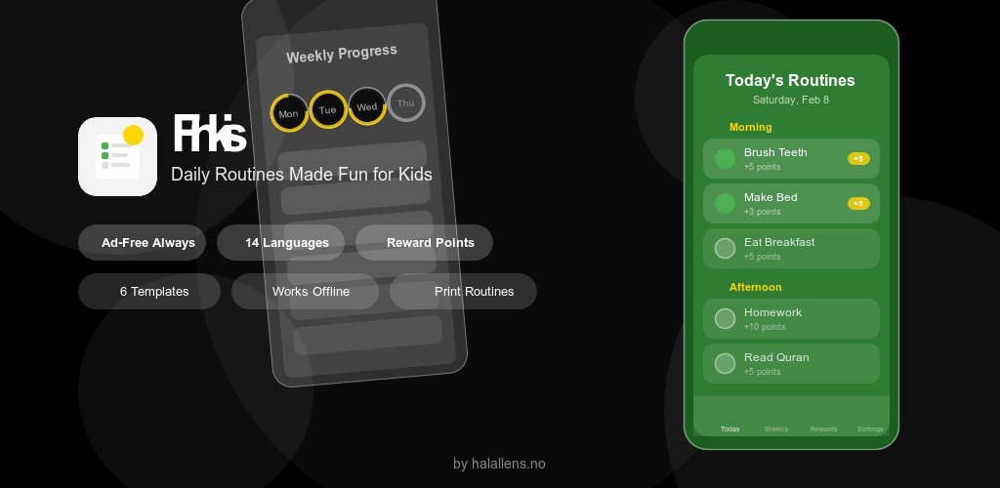

# Flinkis

<div align="center">
  

  **Ad-free routine tracker for kids**

  [](LICENSE)
  [](https://www.android.com/)
  [](https://android-arsenal.com/api?level=26)
  [](https://github.com/halallens-no/Flinkis)
</div>

---

## About

Flinkis helps kids build healthy routines through gamification and parental guidance. Created with love for kids worldwide.

### Features

- 🎯 **Track Activities** — Morning, school, afternoon, evening, and bedtime routines
- ⭐ **Earn Rewards** — Collect points and unlock weekly achievements
- 📋 **Smart Templates** — Pre-built templates or create custom routines
- 🖨️ **Print Support** — Generate printable routine sheets for family discussions
- 👨‍👩‍👧‍👦 **Multiple Profiles** — Manage routines for each child separately
- 🌍 **14 Languages** — English, Norsk, العربية, Dansk, Deutsch, Français, Indonesia, 日本語, 한국어, Melayu, Nederlands, Svenska, ไทย, Türkçe
- 🎨 **3 Themes** — Boy (Blue), Girl (Pink), Neutral (Green)
- 📵 **Completely Offline** — No ads, no tracking, no internet permission required
- 🔐 **Privacy First** — All data stored locally on device

### App Icon


### Feature Graphic



---

## Tech Stack

| Component | Technology |
|-----------|-----------|
| **Language** | Kotlin 2.1.0 |
| **UI Framework** | Jetpack Compose + Material Design 3 |
| **Architecture** | MVVM + Clean Architecture |
| **Dependency Injection** | Hilt 2.56.2 |
| **Database** | Room (SQLite) with Flow |
| **State Management** | ViewModel + DataStore |
| **Navigation** | Jetpack Navigation Compose |
| **Min SDK** | 26 (Android 8.0) |
| **Target SDK** | 35 (Android 15) |

---

## Building from Source

### Prerequisites

- Android Studio Ladybug or later
- JDK 11 or later
- Android SDK API 35
- Git

### Clone Repository

```bash
git clone https://github.com/halallens-no/Flinkis.git
cd Flinkis
```

### Build Debug APK

```bash
./gradlew assembleDebug
```

**Output**: `app/build/outputs/apk/debug/app-debug.apk`

Install on device:
```bash
adb install app/build/outputs/apk/debug/app-debug.apk
```

### Build Release APK / AAB

For Play Store or other distribution, you need a signing key.

#### 1. Generate Release Keystore

```bash
keytool -genkey -v \
  -keystore flinkis-release.jks \
  -keyalg RSA \
  -keysize 2048 \
  -validity 10000 \
  -alias flinkis
```

This will prompt for keystore and key passwords.

#### 2. Create `local.properties` in project root

```properties
FLINKIS_KEYSTORE_FILE=/full/path/to/flinkis-release.jks
FLINKIS_KEYSTORE_PASSWORD=your_store_password
FLINKIS_KEY_ALIAS=flinkis
FLINKIS_KEY_PASSWORD=your_key_password
```

⚠️ **IMPORTANT**: Add `local.properties` to `.gitignore` (already included) — never commit signing credentials.

#### 3. Build Release Artifacts

**APK**:
```bash
./gradlew assembleRelease
# Output: app/build/outputs/apk/release/app-release.apk
```

**AAB (for Google Play)**:
```bash
./gradlew bundleRelease
# Output: app/build/outputs/bundle/release/app-release.aab
```

---

## Project Structure

```
app/src/main/
├── java/com/halallens/flinkis/
│   ├── MainActivity.kt                    # Main activity entry point
│   ├── MyRoutineApp.kt                    # Application class (Hilt setup)
│   ├── data/
│   │   ├── local/                         # Room database setup
│   │   ├── dao/                           # Database access objects
│   │   ├── entity/                        # Database entities
│   │   ├── preferences/                   # DataStore preferences
│   │   └── repository/                    # Repository pattern
│   ├── di/                                # Hilt dependency injection modules
│   ├── domain/
│   │   ├── model/                         # Domain models
│   │   └── usecase/                       # Business logic use cases
│   ├── ui/
│   │   ├── screens/                       # Composable screens
│   │   │   ├── splash/                    # Splash screen
│   │   │   ├── onboarding/                # Onboarding flow
│   │   │   ├── today/                     # Today's activities
│   │   │   ├── weekly/                    # Weekly progress
│   │   │   ├── rewards/                   # Rewards screen
│   │   │   ├── settings/                  # Settings
│   │   │   └── templates/                 # Template selection
│   │   ├── components/                    # Reusable composables
│   │   ├── navigation/                    # Navigation graph
│   │   ├── theme/                         # Theme and colors
│   │   └── util/                          # UI utilities
│   └── util/
│       ├── PrintHelper.kt                 # Printing functionality
│       ├── LocaleHelper.kt                # Localization helper
│       ├── DateUtils.kt                   # Date utilities
│       └── ...
└── res/
    ├── drawable/                          # Vector drawables and images
    ├── mipmap/                            # App icon (adaptive)
    ├── values/                            # English strings
    ├── values-ar/                         # Arabic translations
    ├── values-da/                         # Danish translations
    ├── values-de/                         # German translations
    ├── values-fr/                         # French translations
    ├── values-in/                         # Indonesian translations
    ├── values-ja/                         # Japanese translations
    ├── values-ko/                         # Korean translations
    ├── values-ms/                         # Malay translations
    ├── values-nb/                         # Norwegian translations
    ├── values-nl/                         # Dutch translations
    ├── values-sv/                         # Swedish translations
    ├── values-th/                         # Thai translations
    ├── values-tr/                         # Turkish translations
    └── xml/                               # XML configs
```

---

## Localization (14 Languages)

Flinkis is fully translated into 14 languages. Translations are managed in Android `values-*/strings.xml` directories.

To add a new language:

1. Create `res/values-[code]/strings.xml` (e.g., `values-it/strings.xml` for Italian)
2. Copy all strings from `res/values/strings.xml`
3. Translate each string value
4. Add language code to `LocaleHelper.kt` `SUPPORTED_LANGUAGES` set
5. Add language card to `LanguageSelectionScreen.kt`

### Supported Languages

| Code | Language | Flag |
|------|----------|------|
| en | English | 🇬🇧 |
| nb | Norsk | 🇳🇴 |
| ar | العربية (Arabic) | 🇸🇦 |
| da | Dansk (Danish) | 🇩🇰 |
| de | Deutsch (German) | 🇩🇪 |
| fr | Français (French) | 🇫🇷 |
| in | Indonesia (Indonesian) | 🇮🇩 |
| ja | 日本語 (Japanese) | 🇯🇵 |
| ko | 한국어 (Korean) | 🇰🇷 |
| ms | Melayu (Malay) | 🇲🇾 |
| nl | Nederlands (Dutch) | 🇳🇱 |
| sv | Svenska (Swedish) | 🇸🇪 |
| th | ไทย (Thai) | 🇹🇭 |
| tr | Türkçe (Turkish) | 🇹🇷 |

---

## Contributing

Contributions are welcome! Whether it's bug fixes, new features, translations, or documentation improvements.

### Getting Started

1. **Fork** the repository
2. **Create** a feature branch (`git checkout -b feature/amazing-feature`)
3. **Commit** your changes (`git commit -m 'Add amazing feature'`)
4. **Push** to the branch (`git push origin feature/amazing-feature`)
5. **Open** a Pull Request

### Code Style

- **Kotlin**: Follow [Kotlin Coding Conventions](https://kotlinlang.org/docs/coding-conventions.html)
- **Formatting**: Use Android Studio's built-in formatter (Ctrl+Alt+L)
- **Naming**: Clear, descriptive names for variables, functions, and classes
- **Comments**: Add comments for complex logic; keep code self-documenting

### Testing

Before submitting:

```bash
# Build debug APK
./gradlew assembleDebug

# Run unit tests
./gradlew test

# Build with ProGuard (release build)
./gradlew assembleRelease
```

### PR Guidelines

- Keep PRs focused (one feature/fix per PR)
- Add descriptive commit messages
- Reference related issues (`Fixes #123`)
- Test on multiple device sizes/Android versions
- Verify all 14 languages don't break layout

---

## License

This project is licensed under the **MIT License** — see the [LICENSE](LICENSE) file for details.

### Attribution Requirement

When redistributing or creating derivative works, you **MUST** maintain attribution to HalalLens:

- Include "Created by HalalLens" in app's About screen
- Link to https://halallens.no in documentation
- Keep original license notices intact

### Third-Party Licenses

This app uses open source libraries licensed under Apache License 2.0. See [NOTICE](NOTICE) file for complete attribution and license text.

---

## Credits

**Created by**: [HalalLens](https://halallens.no)
**Inspired by**: Nafisa, who wanted to share kid-friendly apps globally
**Contact**: mac@halallens.no

### Acknowledgments

- The Android Open Source Project (Jetpack libraries)
- Google (Compose, Material Design 3, Hilt)
- JetBrains (Kotlin)
- The open source community

---

## Support

### Bug Reports

Found a bug? Please open an issue on GitHub with:
- Device model and Android version
- Steps to reproduce
- Expected vs actual behavior
- Screenshots (if applicable)

### Feature Requests

Have an idea? Open an issue with:
- Clear description of the feature
- Why it would be useful
- Example use case

### Questions?

- Check existing issues and discussions
- Read through code comments
- Contact us at mac@halallens.no

---

## Roadmap

- [ ] F-Droid distribution
- [ ] Widget support
- [ ] Wear OS companion app
- [ ] Cloud sync (optional)
- [ ] More themes
- [ ] Additional languages
- [ ] Performance optimizations

See [ROADMAP.md](ROADMAP.md) for detailed development history and future plans.

---

## Deployment

### Google Play Store

1. Upload AAB from `app/build/outputs/bundle/release/app-release.aab`
2. Complete store listing (description, screenshots, category)
3. Set content rating
4. Review privacy policy
5. Submit for review

### F-Droid (Community)

Flinkis is open source and can be submitted to F-Droid:

1. Fork F-Droid repository
2. Add metadata in `metadata/com.halallens.flinkis.yml`
3. Submit pull request

---

## Downloads

**Latest Release**: [Flinkis v1.0.1](assets/flinkis-v1.0.1-release.apk) (7.8 MB)

- **Signed APK** (ready to install on Android devices)
- Version: 1.0.1
- Target SDK: Android 15 (API 35)
- Minimum SDK: Android 8.0 (API 26)
- All 14 languages included
- Ad-free, offline-first

---

## Privacy

Flinkis **collects zero data**:

- ✅ No internet permissions
- ✅ No analytics
- ✅ No ads
- ✅ No tracking
- ✅ All data stored locally on device
- ✅ No backend servers

---

Made with ❤️ by HalalLens — [https://halallens.no](https://halallens.no)
